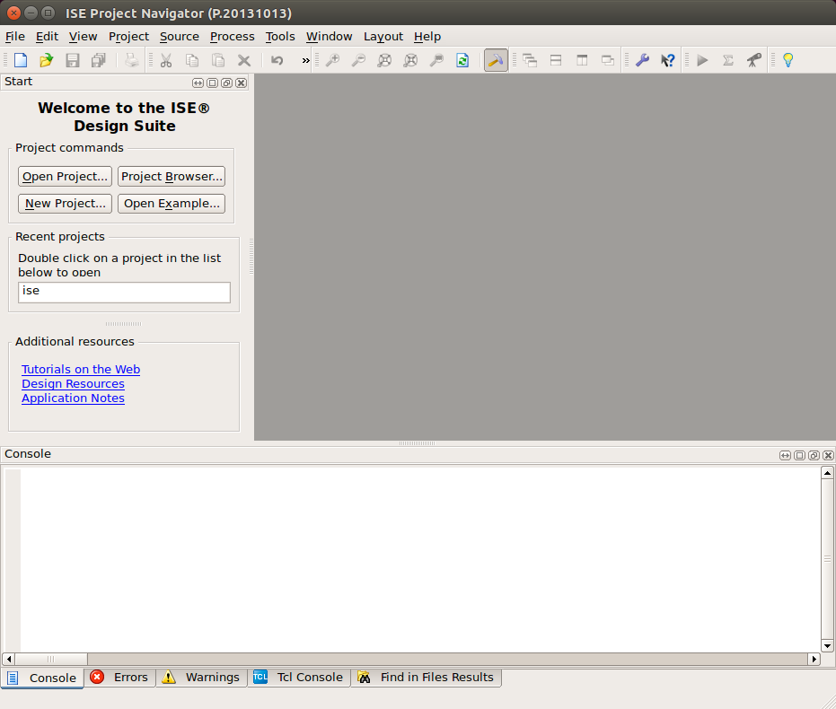
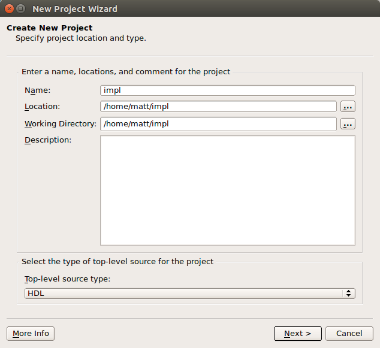
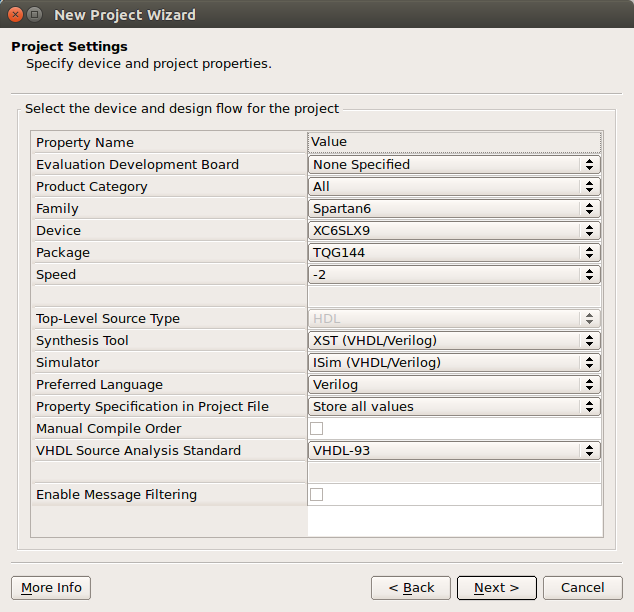
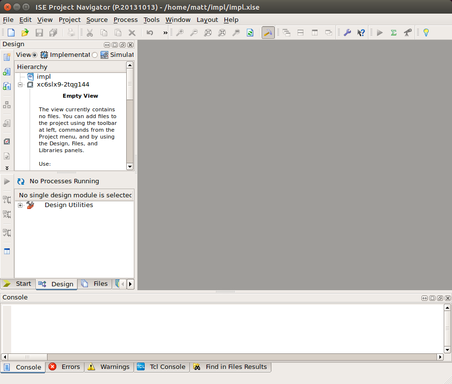
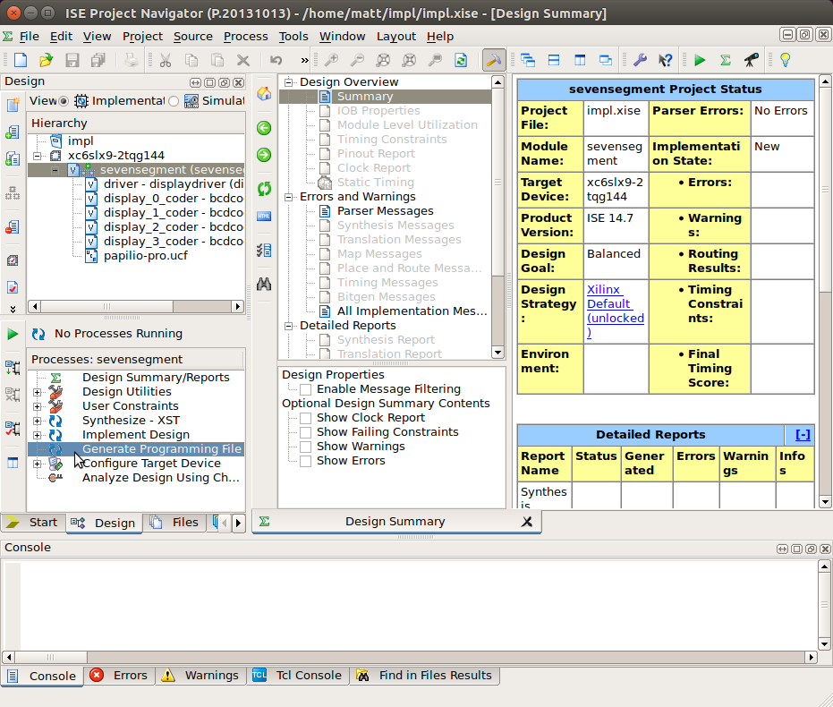
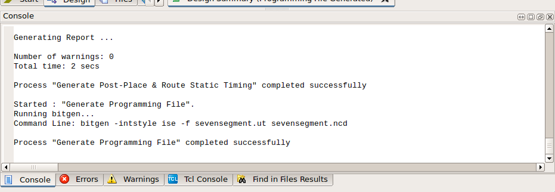

# Implementing a Design for Xilinx Spartan 6

This document describes how to implement a Verilog design on the Papilio Pro's Xilinx Spartan 6 (`xc6slx9-tqg144`) FPGA.

Note that each of the sample projects provide a Makefile (in their respective `syn/` directories) that will implement the design via the command line (use `$ make bit`). These Makefiles invoke the Xilinx command-line tools in a way that replicates the GUI process described below. See the [Makefile section](#synthesizing-with-make) for more details.

## Prerequisites

* A Papilio Pro (or other hardware containing a Xilinx FPGA)

* A Verilog circuit design (such as any one of the example projects)

* A user constraints file providing a mapping between logic IOs and physical pins on the device. ([See the note about user constraints](#A-note-about-user-constraints))

* Xilinx ISE WebPack software ([installation instructions](install-instructions.md))

## Introduction

Recall that _synthesis_ is the process of converting Verilog's high-level language constructs into a network of flip-flops, logic gates, etc. called a _netlist_.

Of course, simply having a netlist representation of our design isn't quite the same as having a real, actual, working chip. There are several additional steps required to create a programming file that can be loaded onto an FPGA. This entire process—from Verilog to programming file—is called _design implementation_. This tutorial will focus on implementing a design on a Xilinx FPGA, but the process is similar for other programmable logic devices (and not all that different for ASICs, either).

These are the steps that Xilinx' Design Suite software executes to implement a design (additional details about these steps can be found on [Xilinx' website](https://www.xilinx.com/support/documentation/sw_manuals/xilinx14_4/ise_c_implement_fpga_design.htm)):

1. Synthesize the design using the Xilinx Synthesis Technology (`xst`) tool.

2. Use the `ngdbuild` tool to translate the synthesized design and user constrains file (`.ucf`) into an internal database representation that Xilinx calls a _Native Generic Database_ (`.ngd` file).

3. Map synthesized primitives described in the NGD to circuit elements available in our specific family of FPGA (IO blocks, look-up-tables, etc.) using the `map` tool. This step produces a _Native Circuit Description_ output (`.ncd` file).

4. Convert the (logical) native circuit description into a physical representation via a process called _place-and-route_ (using the `par` tool). Recall that the FPGA contains an "array" of gates. For each circuit element in your design, place-and-route identifies the specific, physical gate on the FPGA that will manifest it (_placement_) and the interconnections used to attach it to other elements (_routing_). This process results in a transformation of the NGD database.

5. Execute the _Timing Report and Circuit Evaluation_ tool (called `trce`) to assure that the design meets timing constraints and will thusly behave correctly in hardware. For example, assure that the delay through combinatorial paths doesn't exceed the clock period; flip-flop setup and hold constraints are met, etc.

6. Generate a bitstream programming file (`.bit`) from the NGD database using the `bitgen` tool.

Once a bitstream programming file has been generated, it can be loaded on the Papilio using the `papilio-prog` tool ([described in detail here](papilio-instructions.md)), or loaded onto other hardware using a variety of other methods (using a JTAG programming cable, for example).

#### A note about user constraints

A user constraints file (`.ucf`) is a plain-text file authored by the circuit designer that specifies how top-level inputs and outputs in the design should correspond to physical pins on the FPGA. Without these _constraints_, the toolset will randomly choose pins for you (a behavior that's rarely desired). A variety of additional constraint information may also be provided in this file (extensive documentation is [available here](https://www.xilinx.com/support/documentation/sw_manuals/xilinx11/cgd.pdf)).  

A generic UCF (`BPC3011-Papilio_Pro-general.ucf`) defining a pin mapping for every logical signal shown on the Papolio Pro's schematic can be found in the top-level `papilio/` directory. Additionally, each of the example projects has its own customized UCF located in the project's `papilio/` subdirectory.

If you create a new project of your own, you should start with a copy of the generic UCF, then:

1. Modify it such that each logical signal name (the value immediately following the `NET` keyword) matches the name of an `input` or `output` in your top-level module. Leave the `LOC` value and other constraints following the `|` symbol unmodified.

2. Optionally remove all other (unused) `NET` statements to prevent warnings.

Note that the first four (non-comment) lines of the file should be always be present:

```
## Prohibit the automatic placement of pins that are connected to VCC or GND for configuration.
CONFIG PROHIBIT=P144;
CONFIG PROHIBIT=P69;
CONFIG PROHIBIT=P60;

NET CLK            LOC="P94"  | IOSTANDARD=LVTTL | PERIOD=31.25ns;          
```

**Use care when authoring this file.** It's important that pins on the FPGA are connected correctly. Incorrect connections may produce short-circuits or other faults that could damage the FPGA or circuit board.

## Synthesizing with ISE Design Suite

These instructions describe how to implement a design using Xilinx' ISE Design Suite GUI application.

Note that these instructions assume that you've sourced the Xilinx `settings32.sh` environment setup script (as described in the [setup instructions](install-instructions.md)).

#### Step 1: Start ISE Design Suite

Start the application with:

```
$ ise
```

The Design Suite application should launch and you should be presented with the Project Navigator:



#### Step 2: Create a new project

From the File menu, choose "New Project...". This will start the new project wizard, like:



Choose a location and name for your Design Suite project. There is no requirement to keep the project in the same location as your Verilog source; you can create the project anywhere you like.

Click "Next"

#### Step 3: Specify the target device

Enter information about the FPGA device you intend to target the design to. For the Papilio Pro, enter the values (exactly) as shown below:



Click "Next" to be presented with a summary screen, then click "Finish" to create the project and return to the Project Navigator:



#### Step 4: Add sources

From the "Project" menu choose "Add Source..." then navigate to your project's RTL source and add it to the project. Repeat this process to add your chip's user constraint file (`.ucf`).

Do not add your testbench or other test sources.

You should see your chip's design hierarchy in the top-right pane of the navigator window (you should notice that ISE "detects" the hierarchical relationship between modules with the root at the top of the list). To the right, you'll see a "Project Status" table (largely empty) that reports status during and after the implementation process.  



#### Step 5: Generate programming file

Click and select the top module of your design in the hierarchy view, then double-click the "Generate Programming File" process in the "Processes" list immediately below the hierarchy.

Note that you must click and highlight the top-level module in your design first; if you select another element in the hierarchy list you will not have the the option to generate a programming file.

Upon completion, you should see "Process 'Generate Programming File' completed successfully" in the console window. If, instead, you receive an error, you'll need to investigate the issue and try again.

For good measure, check the warnings tab to assure the implementation process didn't discover potential issues that you're not aware of. You should generally not have any warnings.



## Synthesizing with Make

It is not strictly necessary to use the ISE graphical user interface to implement a circuit design. Xilinx provides a suite of complementary command-line tools. As a matter of fact, the GUI simply delegates to the command-line tools when performing various tasks. Note, however, that these command-line tools are part of ISE WebPack; you must still install this software even if you don't intend to use the actual ISE application.

Each example project has a Makefile that executes `xst`, `ngdbuild`, `map`, `par`, `trce` and `bitgen` against the required project (`.prj`) and synthesis script (`.xst`) to produce a programming file.  
