# MicroBlaze Microcontroller

In this project, we'll create a microcontroller "system on a chip" by creating a design that incorporates a Xilinx MicroBlaze CPU, 16KB of "block" RAM (memory that's embedded inside the FPGA), a general purpose output (_GPO_) module to control LEDs via software, and the firmware that will control it.

This is not a trivial exercise. There are quite a few steps involved and each has very little margin for error. It is important that projects are created in the locations described and named identically to what is shown. Be sure to follow these instructions carefully. Even minor deviations in naming or configuration will prevent this from working. And when it doesn't, don't expect helpful error messages or warnings to guide you along the way. This toolchain is not beginner friendly.

**You've been warned.** Stick with the script until you've got a good sense of what you're doing...

## Overview

Here are the steps we'll follow to complete our design:

1. [Setup the environment](#setup)
2. [Generate the MicroBlaze CPU core](#create-the-microblaze-core)
3. [Create the firmware](#create-the-firmware)
4. [Run a simulation](#simulate) (of our hardware and software)
5. [Synthesize the design](#synthesize-the-design)
6. [Create the FPGA programming file](#create-the-programming-file)

## Setup

There are a couple problems with our toolset that we need to resolve before getting started:

#### Link `gmake` to `make`

The Xilinx software development kit (`xsdk`) that we'll be using expects to be able to call `gmake` (GNU Make) instead of the system `make`. For Ubuntu, the difference is irrelevant and the problem is easily solved with a link:
```
$ sudo ln -s /usr/bin/make /usr/bin/gmake
```

#### Check for a buggy iVerilog

Versions of Icarus Verilog older than 10.x contain a bug that prevents it from simulating Xilinx' block memory models. (This issue would not have manifested itself in earlier tutorials.) Check the version of `iverilog` before continuing (by inspecting the first line of the `man` page, `$ man iverilog`).

If you've got an old version of `iverilog` you can attempt to upgrade with `sudo apt upgrade`. If your package manager isn't able to install Icarus Verilog 10 or better, you can manually build and install the tool from source:

1. Download the source code by navigating to a directory where you'd like to store it, then:
```
$ git clone https://github.com/steveicarus/iverilog.git
```

2. Change into the `iverilog` directory that was created by checking out the source:
```
$ cd iverilog
```

3. Build and run the configuration scripts:
```
$ sh autoconf.sh
$ ./configure
```

4. Compile the software, being aware that your compile will likely fail as a result of various tools being absent on your Ubuntu build (stuff like `bison` and `flex`). You can easily remedy these errors by installing the tool each time your reach an error. For example: `sudo apt install bison`.
```
$ make
```

5. When the compile has succeeded, install the binaries with:
```
$ sudo make install
```

## Create the MicroBlaze Core

A _core_ is the integrated circuit equivalent of a library in software. That is, it's a black box circuit developed by a third party which we instantiate and use inside our own circuit without regard for the implementation details. It's IO port definition is, essentially, its API.

Unlike software libraries, Xilinx' cores are not one-size-fits-all; we don't simply include them in our project. They are configured specifically for our use then dynamically generated using the "Xilinx Core Generator" tool.

[MicroBlaze](https://en.wikipedia.org/wiki/MicroBlaze) is a microprocessor design from Xilinx that is "easily" incorporated into an FPGA and even includes a simulation model that will let us simulate our design and watch the execution of our firmware. Note, however, that unlike the other Verilog RTL we've used in previous projects, this Verilog is intended purely for simulation. The code contained within is _not_ synthesizable and is _not_ used when generating the FPGA programming file. (Xilinx uses some "secret sauce" unrelated to Verilog to instantiate the MicroBlaze inside the FPGA.)

1. Open the Xilinx `coregen` tool with `$ coregen`. If it seems that command doesn't exist (or isn't in your path) then you likely haven't installed Xilinx ISE Webpack or sourced the setup shell script described in the software setup instructions. Otherwise, you should momentarily be presented with this screen:
<br><br>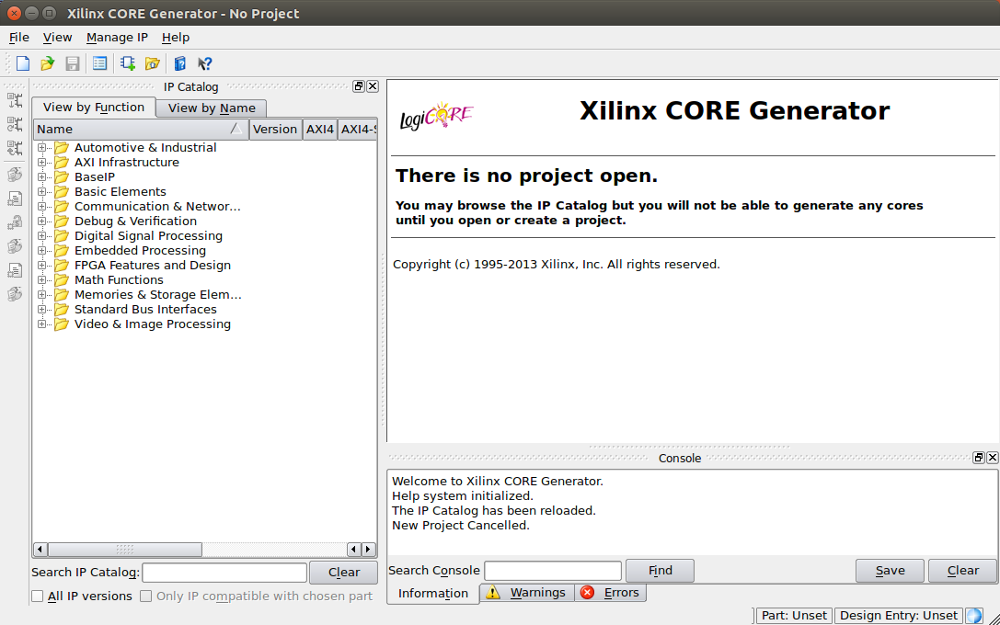

2. Create a new project by choosing "File" -> "New Project" from the menubar. Create the new project inside the `core` directory of this tutorial. Use the default project name: `coregen`.

3. You'll be prompted to select "Project Options". These define the type of FPGA we're targeting and some selections about how we'd like the simulation model built. Enter these options exactly as shown (no changes required to the "Advanced" section):
<br><br>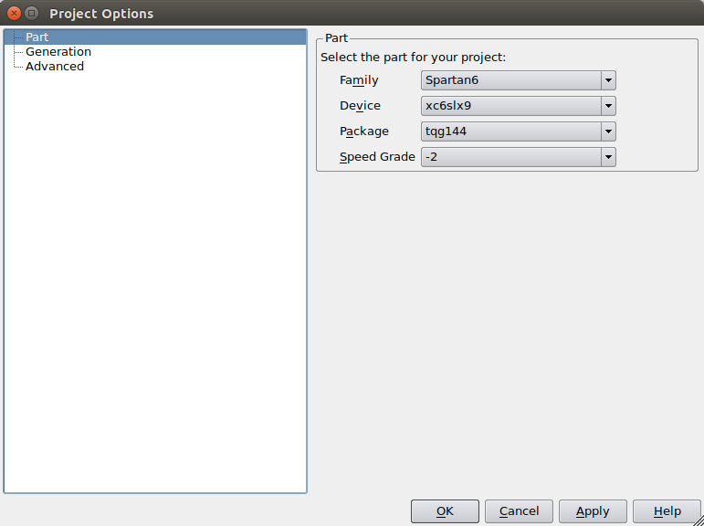
<br><br>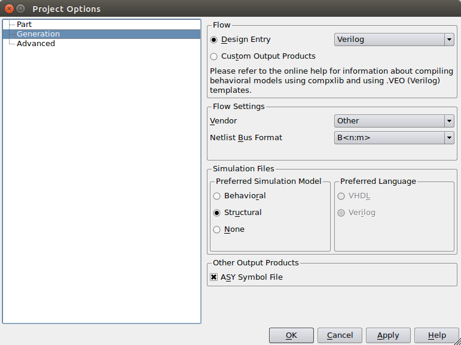

4. Close the project options by clicking "OK", then find the MicroBlaze core within the available library of Xilinx-provided cores. Fastest way to do this is to type `microblaze` into the "Search IP Catalog" field.

5. Double-click on the "MicroBlaze MCS 1.4" element in the library tree. This will display the core's configuration options. Enter these options _exactly_ as shown (paying close attention to the change in input clock frequency, memory size and enabling the trace bus):
<br><br>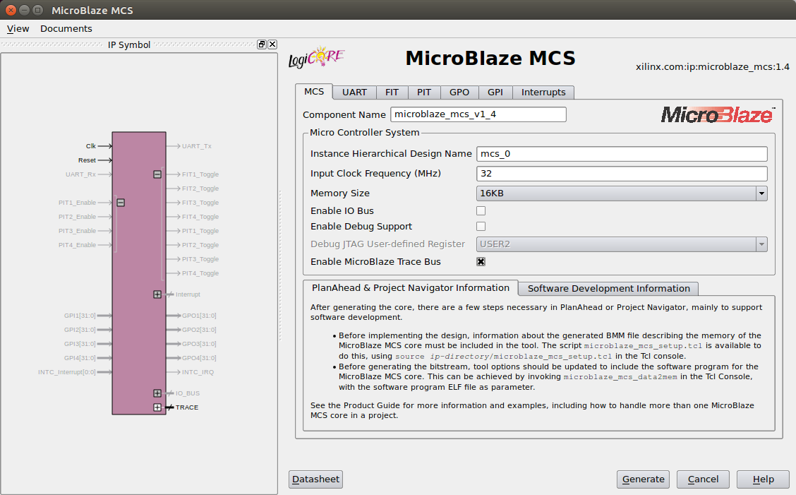

6. Click the "GPO" tab to view general purpose output configuration and enter these options exactly as shown:
<br><br>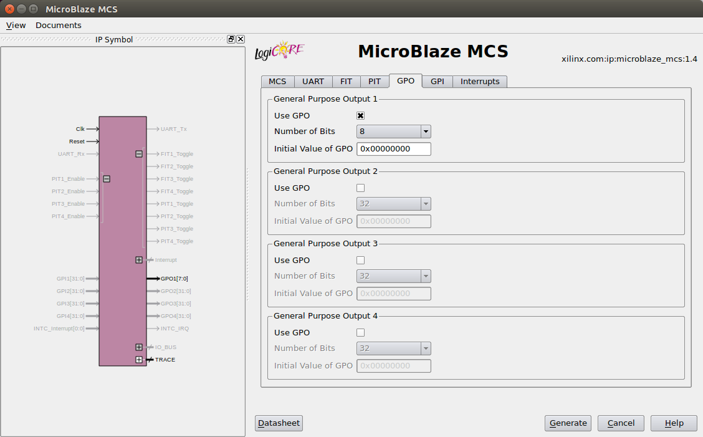

7. Generate the core by clicking the "Generate" button. This process will take several minutes to complete. When it does, you'll see this screen:
<br><br>

Congratulations! You've created your first microprocessor core! Dismiss the "Readme" dialog and quit the Coregen application. Then, take a look at the contents of the `core/` directory to admire your handiwork.

## Create the Firmware

Creating firmware for an embedded system is often a non-trivial venture. Remember, we're not creating an "app" for an existing operating system or framework, but bootstrapping the computer itself. The exact details and requirements of which depend, of course, on the computer architecture. (Which, in our case, depends on the configuration of the cores in our hardware design--joy!)

Fortunately, Xilinx takes much of the pain out of this for us. Their Eclipse-based `xsdk` knows how to compile and link code for our architecture based on some hints it receives from the Core Generator project.

1. Start the Xilinx Software Development Kit with:
```
$ xsdk
```

2. If prompted to choose a workspace, select the `src/` directory of this tutorial. If not, close the "Welcome..." tab that appears on startup, then, from the File menu, choose "Switch Workspace" -> "Other..." and browse to the `src/` directory. **Note:** It is important that you change your workspace to this location.
<br><br>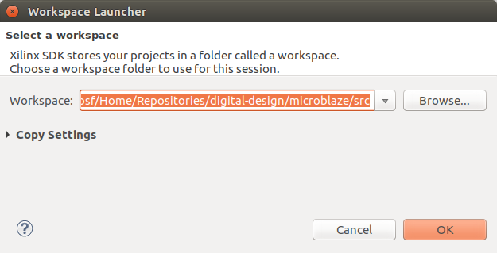

3. From the File menu, choose "New" -> "Application Project". You'll be presented with a screen like the one shown below. Enter `helloworld` as the project name and assure that the location is the `src/` directory of this tutorial.
<br><br>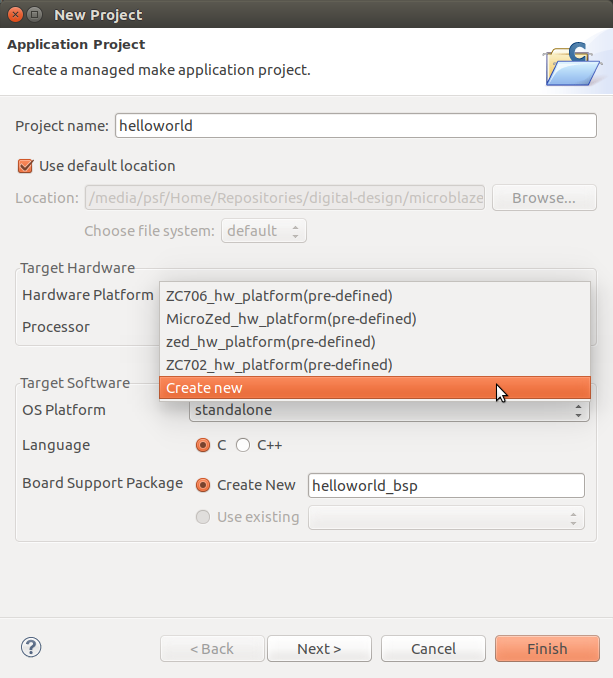

4. From the "Hardware Platform" drop-down menu, choose "Create new". The following dialog box will appear. Enter the project name `papilio-pro` then specify a "Target Hardware Specification" by clicking the adjacent "Browse..." button and selecting the `microblaze_mcs_v1_4_sdk.xml` file that was generated by the `coregen` tool inside the `core/` directory.
<br><br>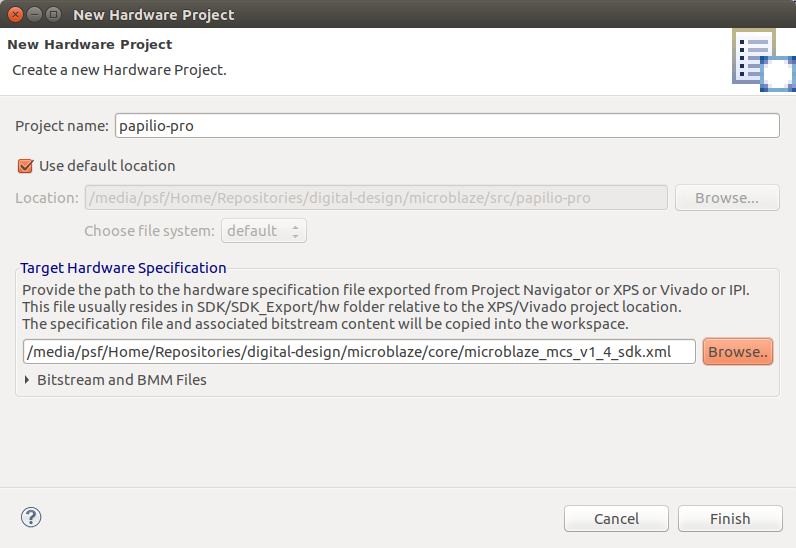

5. Click "Finish" to create the hardware project. You'll be presented again with the "New Project" dialog. It should look like the screenshot shown below. If so, click "Finish".
<br><br>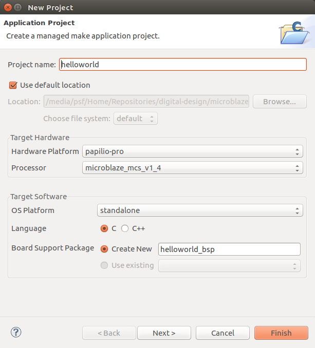

6. The workspace window should appear (as below) and the compile process should have succeeded. You should have three (related) projects in your workspace: `helloworld` (our firmware's source code), `helloworld_bsp` (a _board support package_ containing software libraries for configuring and driving Xilinx' components like the GPO module) and `papilio-pro` (a hardware specification providing information about memory configuration and address spaces in the core).
<br><br>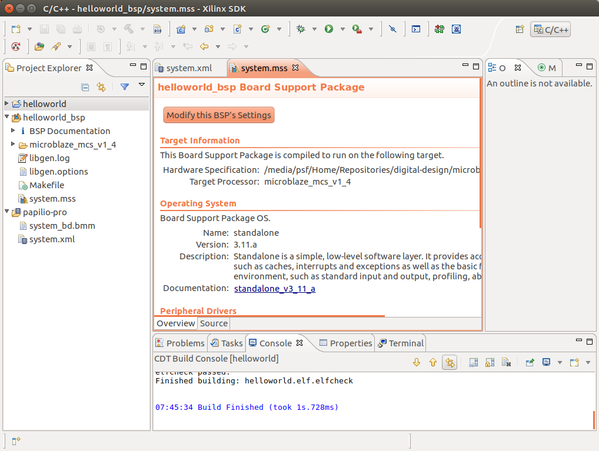

7. Our `helloworld` firmware will simply blink all eight LEDs on the LogicStart MegaWing. We can achieve this by replacing the contents of the `helloworld.c` file (in the `helloworld` project, under `src/`) with the following:

```
#include <stdio.h>
#include "platform.h"
#include "xparameters.h"
#include "xiomodule.h"

int main() {

  u32 data = 0x00;
  XIOModule gpo;

  init_platform();

  XIOModule_Initialize(&gpo, XPAR_IOMODULE_0_DEVICE_ID);
  XIOModule_Start(&gpo);

  while (1) {
    data = ~data;
    XIOModule_DiscreteWrite(&gpo, 1, data); // toggle LEDs (channel 1)

    // Delay to make led toggle human perceptible. Comment-out for better simulation
    int i = 0 ;
    while (i < 200000) {
      i++ ;
    }
  }

  // Not reachable, for completeness only
  cleanup_platform();
  return 0;
}
```

Congratulations! You've now created your first program that will run on your own hardware design.

## Simulate

At this point we are ready to simulate the hardware design with our firmware running inside of it. The process for doing so is a bit more complex than the simulations we've run in earlier tutorials; the details of which are encapsulated in the `Makefile` and described below.

To run the simulation:

```
$ make
```

Which should produce the following output (we can safely ignore the warnings about the standard inconsistency).

```
WARNING: /opt/Xilinx/14.7/ISE_DS/ISE/verilog/src/unisims/RAMB16BWER.v:410: $readmemh: Standard inconsistency, following 1364-2005.
WARNING: /opt/Xilinx/14.7/ISE_DS/ISE/verilog/src/unisims/RAMB16BWER.v:410: $readmemh: Standard inconsistency, following 1364-2005.
WARNING: /opt/Xilinx/14.7/ISE_DS/ISE/verilog/src/unisims/RAMB16BWER.v:410: $readmemh: Standard inconsistency, following 1364-2005.
WARNING: /opt/Xilinx/14.7/ISE_DS/ISE/verilog/src/unisims/RAMB16BWER.v:410: $readmemh: Standard inconsistency, following 1364-2005.
WARNING: /opt/Xilinx/14.7/ISE_DS/ISE/verilog/src/unisims/RAMB16BWER.v:410: $readmemh: Standard inconsistency, following 1364-2005.
WARNING: /opt/Xilinx/14.7/ISE_DS/ISE/verilog/src/unisims/RAMB16BWER.v:410: $readmemh: Standard inconsistency, following 1364-2005.
WARNING: /opt/Xilinx/14.7/ISE_DS/ISE/verilog/src/unisims/RAMB16BWER.v:410: $readmemh: Standard inconsistency, following 1364-2005.
WARNING: /opt/Xilinx/14.7/ISE_DS/ISE/verilog/src/unisims/RAMB16BWER.v:410: $readmemh: Standard inconsistency, following 1364-2005.
VCD info: dumpfile waveform.vcd opened for output.
LEDs changed state to 00 at time          0 ns
LEDs changed state to ff at time      45948 ns
```

Note how the LEDs change from `00` (off) to `ff` (on). The fact that this occurs is proof that our software is running on the design. Eventually, the LEDs will toggle back to off. But, recall, that our software has a long delay in it to make the change perceptible to the human eye. We'd have to run our simulation quite a long time before we saw the LEDs change again. (Of course, you could remove that delay from the code, extend the simulation time in `test/testbench.vt` and re-run the simulation if you were so interested...)

Want further proof that things are working? Open the generated waveform (`$ gtkwave waveform.vcd`) and examine the trace signals (those starting with `tr_`) in the top-level, `uut` module:

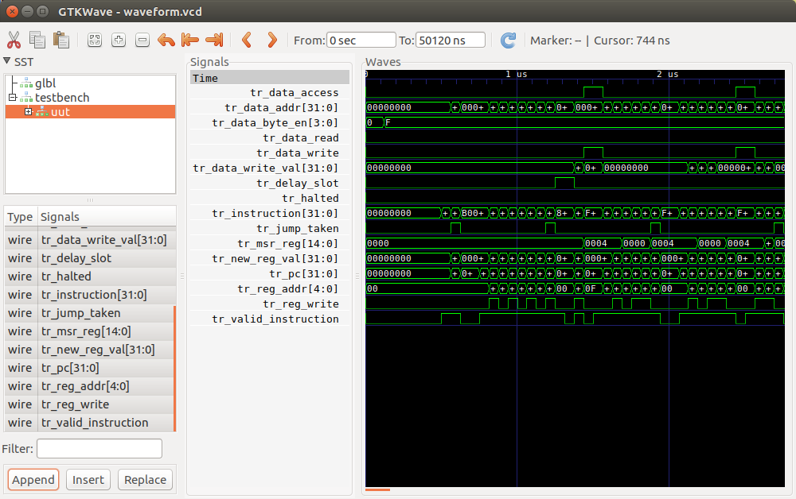

#### Simulating the MicroBlaze model

The MicroBlaze simulation model (`core/microblaze_mcs_v1_4.v`) that was generated by the `coregen` tool is "structural" in nature; that is, rather than describing the CPU's behavior in straight RTL terms (i.e., with `assign` and `always@` statements), it defines the CPU in terms of other components (called _cells_) that are part of Xilinx' library. We need to make these cells available to Icarus Verilog in order for it to simulate.

There are three Xilinx cell library directories that must pass to `iverilog` when we invoke the simulator (using the `-y` command line switch):

* `-y $(XILINX)/verilog/src/simprims`
* `-y $(XILINX)/verilog/src/unimacro`
* `-y $(XILINX)/verilog/src/unisims`

The `$(XILINX)` variable should be defined in your environment to point to the Xilinx installation directory (`/opt/Xilinx/14.7/ISE_DS/ISE`) via the Xilinx setup shell script described in the tool setup instructions. Verilog will search these directories for modules matching those declared elsewhere in the design.

Finally, there's a bit of "global" logic that's required to initialize/reset Xilinx-generated cores which we'll add to the simulation, too: `$(XILINX)/verilog/src/glbl.v`

#### Initializing memory with our code

In order to run a simulation of our firmware executing on the MicroBlaze CPU, we have to load our code into memory. Xilinx' BRAM memory models are designed to do just this. At the start of the simulation, they will attempt to initialize themselves by loading data from `.mem` files (an industry standard for describing the contents of a memory).

Xilinx provides a tool called `data2mem` that will convert our compiled firmware from [ELF format](https://en.wikipedia.org/wiki/Executable_and_Linkable_Format) to `.mem`, named in the convention expected by the memory models. Executing `make memory` (a subtask of `simulate`) will generate these files in the root directory of the tutorial.

When we're ready to program our FPGA with this design, we will use the same tool to embed our code in the hardware design so that as soon as the chip initializes, it has the firmware already in memory (like making a ROM inside the FPGA).

## Synthesize the design

Now that we've proven the correctness of our design through simulation, we're ready to synthesize it into a Xilinx `.bit` file. This procedure is largely identical to the synthesis process used for other projects. (Refer to the [synthesis instructions](../docs/synthesis-instructions.md) for more detailed instructions.)

1. Create a new ISE project in the root directory of this project (`microblaze/ise`). As always, be sure to configure the project with the correct Spartan 6 part properties (part `xc6slx9`, package `tqg144`, speed grade `-2`).

2. Add the top-level design (`rtl/microblaze.v`) and the Papilio Pro UCF (`papilio/papilio-pro.ucf`) sources to the project.

3. Include the MicroBlaze in the design by adding the `core/microblaze_mcs_v1_4.xco` core specification file to the hierarchy (**do not** add the `.v` simulation file). Your project hierarchy should look like:
<br><br>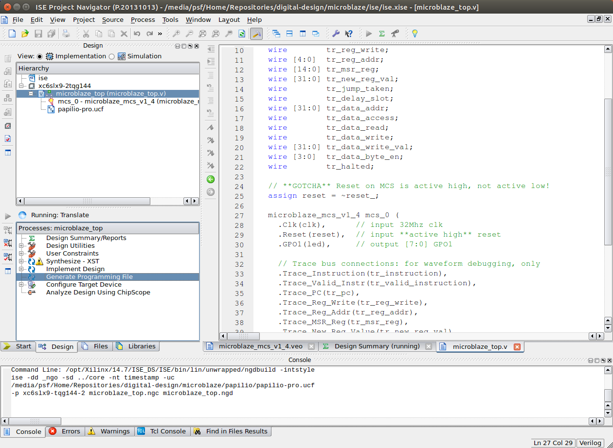

4. At the bottom of the ISE project window, select the "Tcl Console" tab. If no such tab is visible, choose "View" -> "Panels" -> "Tcl Console" from the menubar to show it. Then, in the "Command >" field at the bottom of the panel, enter `source ../core/microblaze_mcs_setup.tcl`. This will perform some custom configuration of the ISE synthesis process specific to using this core and will cause the translate process to generate a special, post-place-and-route `.bmm` file that we'll use to create the final programming file. If this step succeeds, you'll see the following printed in the Tcl Console:
```
Command>source ../core/microblaze_mcs_setup.tcl
microblaze_mcs_setup: Found 1 MicroBlaze MCS core.
microblaze_mcs_setup: Added "-bm" option for "microblaze_mcs_v1_4.bmm" to ngdbuild command line options.
microblaze_mcs_setup: Done.
```

5. Lastly, generate the base `.bit` file by selecting the top-level module (`microblaze`) in the hierarchy. Then, double-click the "Generate Programming File" step in the process list below.

## Create the programming file

The programming file created above (`ise/microblaze.bit`) is a perfectly good programming file, but it doesn't contain our firmware "burned in" to it. If you load it onto the FPGA, the processor core will come out of reset and begin executing instructions out of the uninitialized memory. Crash! (The visible result of which will be nothing--no LEDs blinking.)

To correct this, we need to burn our firmware into the design using Xilinx' `data2mem` tool, providing the `.bit` produced in the last step; the firmware we compiled (in ELF format); and the `_bd.bmm` file generated by ISE when we synthesized the design with `microblaze_mcs_setup.tcl`. Note that a `.bmm` file (`core/microblaze_mcs_v1_4.bmm`) was initially generated when we created the core. This file is _not_ the same as the Block Memory Model model used in this step (`core/microblaze_mcs_v1_4_bd.bmm`).

1. Create the firmware-embedded programming file by executing:

```
$ make bit
```

Upon completion, this will create a `ise/microblaze-code.bit` programming file that's ready to be loaded onto the Papilio Pro. Congratulations, you've created your first system-on-a-chip!

#### Problems with `data2mem`?

Note that I have run into problems executing the `data2mem` command on Ubuntu. If you receive an error like:

```
FATAL:Data2MEM:44 - Out of memory allocating 'getMemory' object of 704000000 bytes.
    Total memory already in use is 9788 bytes.
    Source file "../s/DeviceTableUtils.c", line number 5692.
```

Be advised that this is a problem in `data2mem` and not with your design or process. The only workaround I've found is to reboot Ubuntu and try again.

#### A note about Block Memory Models (`.bmm` files)

A Block Memory Model describes the addressable space of a Xilinx Block RAM and with what data it should be initialized.
So what's the difference between `core/microblaze_mcs_v1_4.bmm` and `core/microblaze_mcs_v1_4_bd.bmm`? The first file describes how to initialize the memory in terms of the simulation model:

```
...
  mcs_0/U0/lmb_bram_I/RAM_Inst/Using_B16_S4.The_BRAMs[0].RAMB16_S4_1 [31:28] INPUT = microblaze_mcs_v1_4.lmb_bram_0.mem
...
```  

The second file (`_bd.bmm`) includes the same information, but annotated with the actual, synthesized cell representing the memory (`PLACED = X1Y14`). Thus, the first file provides enough information to load the code into the logical simulation model, the second contains information about how to load the firmware into the physical device:

```
...
  mcs_0/U0/lmb_bram_I/RAM_Inst/Using_B16_S4.The_BRAMs[0].RAMB16_S4_1 RAMB16 [31:28] [0:4095] INPUT = microblaze_mcs_v1_4.lmb_br\
am_0.mem PLACED = X1Y14;
...
```
